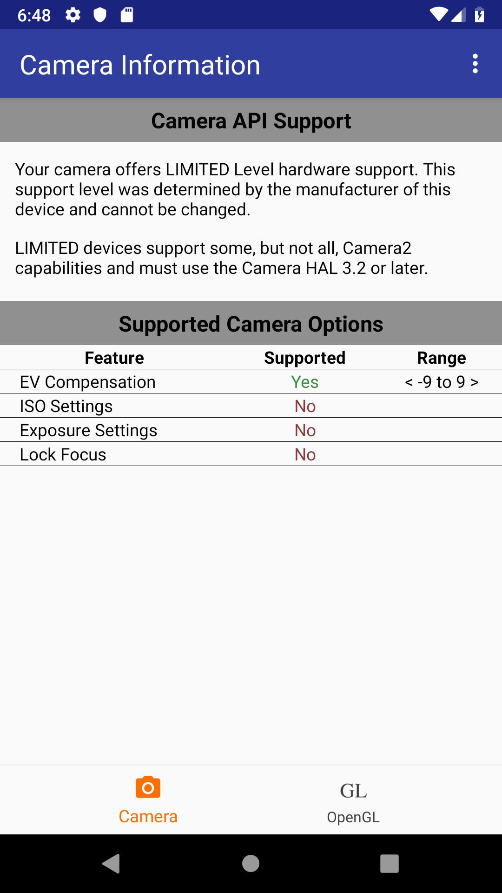
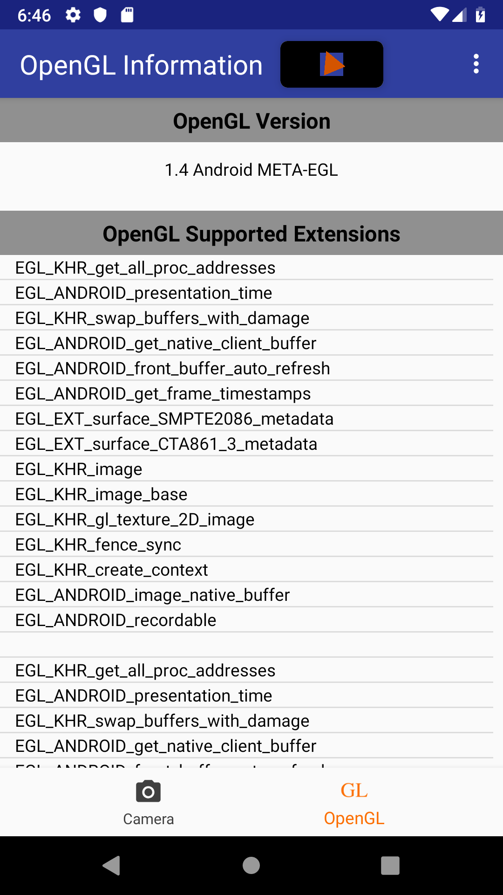

## Overview

An app to take a quick look at device Camera and OpenGL capability.

## Screenshots

<p float="left">
   
  
</p>

## Motivation

While developing an application that assists in Astrophotograhy and Telescope setup, I realized how few
Android devices actually support the more advanced features available. This app provides a quick look
at the Camera and OpenGL capabilities of a device as a way to prevent unrealistic expectations from 
the user for the given device's camera hardware.

## Code Snippets

Vertex Shader:
```
#version 300 es

uniform mat4 uMVPMatrix;
in vec4 vPosition;

void main() {
    gl_Position = uMVPMatrix * vPosition;
}

```

Fragment Shader:
```
#version 300 es

precision mediump float;

uniform vec4 vColor;
out vec4 fragColor;

void main() {
  fragColor = vColor;
}
```

Compile Shaders:

```
 /**
     * Creates a new program from the supplied vertex and fragment shaders
     * @param vertexFile Asset file containing the vertex shader code
     * @param fragmentFile Asset file containing the fragment shader code
     * @return A handle to the program, or 0 on failure
     */
    fun createProgram(vertexFile: String, fragmentFile: String): Int {

        val vertexSource = getStringFromFileInAssets(vertexFile)
        val vertexShader = compileShader(GLES30.GL_VERTEX_SHADER, vertexSource)
        if (vertexShader == 0) { return 0 }

        val fragmentSource = getStringFromFileInAssets(fragmentFile)
        val fragmentShader = compileShader(GLES30.GL_FRAGMENT_SHADER, fragmentSource)
        if (fragmentShader == 0) { return 0 }

        var program = GLES30.glCreateProgram()
        checkGLError("glCreateProgram")
        if (program == 0) {
            Timber.e("Could not create program from %s, %s", fragmentFile, vertexFile)
        } else {

            GLES30.glAttachShader(program, vertexShader)
            checkGLError("glAttachShader")
            GLES30.glAttachShader(program, fragmentShader)
            checkGLError("glAttachShader")
            GLES30.glLinkProgram(program)

            val linkStatus = IntArray(1)
            GLES30.glGetProgramiv(program, GLES30.GL_LINK_STATUS, linkStatus, 0)
            if (linkStatus[0] != GLES30.GL_TRUE) {
                Timber.e("Could not link program: %s", GLES30.glGetProgramInfoLog(program))
                GLES30.glDeleteProgram(program)
                program = 0
            }
        }

        return program
    }

```
## License

Licensed under the Apache License, Version 2.0 (the &quot;License&quot;);
you may not use this file except in compliance with the License.
You may obtain a copy of the License at
http://www.apache.org/licenses/LICENSE-2.0
Unless required by applicable law or agreed to in writing, software
distributed under the License is distributed on an &quot;AS IS&quot; BASIS,
WITHOUT WARRANTIES OR CONDITIONS OF ANY KIND, either
express or implied.
See the License for the specific language governing
permissions and limitations under the License.